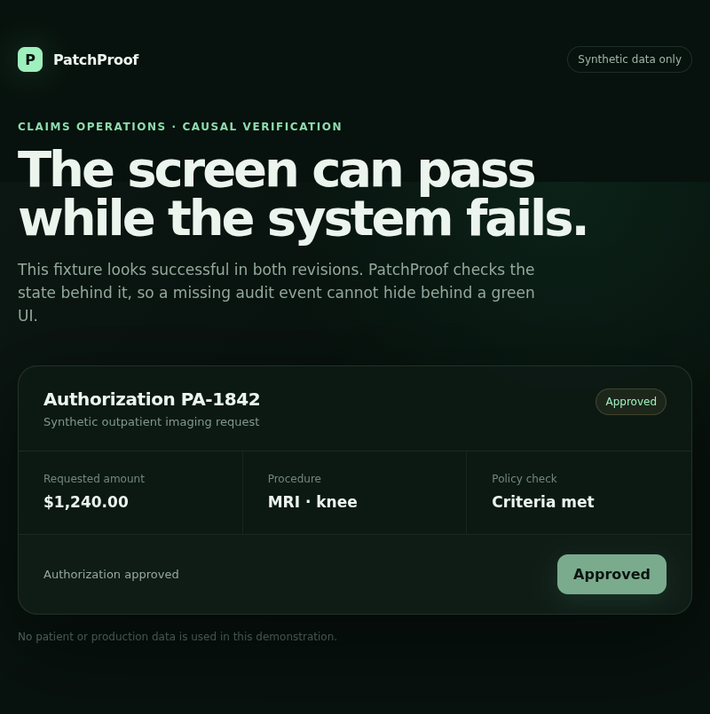

<div align="center">

# PatchProof

### The screenshot passed. The patch did not.

[](https://github.com/khaledmoayad/solari-cookbook/actions/workflows/patchproof.yml)

[Live cloud results](examples/patchproof-ts/evidence/2026-09-05/REPORT.md) · [Run it yourself](examples/patchproof-ts) · [Inspect the fix](https://github.com/khaledmoayad/solari-cookbook/compare/ddf6bb3303508d8c981328d3128b22780a1de039...582715e93c7b14fd012cafeacb515d0d12206d78)

</div>

PatchProof checks a declared behavior change between two exact commits. It runs
the same accessible browser journey against immutable base and head commits in
separate Solari sandboxes, records both sessions, checks the visible UI, and
queries a machine-readable state oracle before emitting a hashed receipt.

The included synthetic authorization screen reports success in both revisions.
The base silently drops the required audit event; the head records exactly one.
A screenshot cannot tell them apart. PatchProof can.

```text
base SHA ──> isolated app ──> recorded journey ──> auditEvents = 0
                                                       │
head SHA ──> isolated app ──> same journey ─────> auditEvents = 1
                                                       │
                                                       ▼
                                  commit-bound, content-addressed receipt
```

The build is intentionally narrow: it does not certify an entire repository.
It asks a practical review question: **did the same action produce the declared
state change, with the visible guardrails still present?** The fixture uses an
in-memory counter, not a production database. Its app-provided oracle is trusted;
this is an executable regression check, not a security certification.

## Real Solari run · September 5, 2026

**Passed in 49.9 seconds.** Two disposable Solari sandboxes, two recorded Solari
browser sessions, one real click in each replay. No local-browser stand-in.

| Observed evidence | Buggy base | Fixed head |
| --- | --- | --- |
| Screen after clicking | Authorization approved | Authorization approved |
| API audit count | **0** | **1** |
| Screenshot | [View](examples/patchproof-ts/evidence/2026-09-05/base/screenshot.png) | [View](examples/patchproof-ts/evidence/2026-09-05/head/screenshot.png) |
| Recorded browser journey | [Replay data](examples/patchproof-ts/evidence/2026-09-05/base/replay.ndjson) | [Replay data](examples/patchproof-ts/evidence/2026-09-05/head/replay.ndjson) |



[Read the execution trace and artifact hashes](examples/patchproof-ts/evidence/2026-09-05/REPORT.md).
Replays retain the DOM and click events; private Solari URLs are redacted before
hashing. Both sandboxes were destroyed after the checks.

---

## Solari Cookbook

Short, runnable examples for [Solari](https://getsolari.com) — cloud browsers,
sandboxes, and desktops behind one API key.

Every example in this repo is a complete program you can run in under a minute.
They are deliberately small: one idea each, no framework, no scaffolding to read
past. Copy one into your project and change the parts you care about.

## Examples

### End-to-end workflows

| Example | Language | What it shows |
| --- | --- | --- |
| [patchproof-ts](examples/patchproof-ts) | TypeScript | Prove a patch by comparing immutable base/head workflows, state oracles, and recorded evidence |

### Cloud browser

| Example | Language | What it shows |
| --- | --- | --- |
| [browser-quickstart-ts](examples/browser-quickstart-ts) | TypeScript | Launch a browser, open a page, read it |
| [browser-quickstart-py](examples/browser-quickstart-py) | Python | Launch a browser, open a page, read it |
| [browser-stealth-proxy-ts](examples/browser-stealth-proxy-ts) | TypeScript | Stealth mode + residential proxy egress |
| [browser-profiles-ts](examples/browser-profiles-ts) | TypeScript | Log in once, reuse the session forever |
| [browser-session-recording-py](examples/browser-session-recording-py) | Python | Record a session, download the replay |

### Sandbox

| Example | Language | What it shows |
| --- | --- | --- |
| [sandbox-quickstart-ts](examples/sandbox-quickstart-ts) | TypeScript | Run a command, write and read files |
| [sandbox-code-interpreter-py](examples/sandbox-code-interpreter-py) | Python | Stateful Python kernel for agent loops |
| [sandbox-port-preview-ts](examples/sandbox-port-preview-ts) | TypeScript | Expose a server in the VM on a public URL |

### Desktop

| Example | Language | What it shows |
| --- | --- | --- |
| [desktop-computer-use-py](examples/desktop-computer-use-py) | Python | Screenshot, click, and type on a Linux GUI |

## Running an example

Each directory is self-contained.

```bash
git clone https://github.com/solari-sdk/solari-cookbook.git
cd solari-cookbook/examples/browser-quickstart-ts

npm install                          # or: pip install -r requirements.txt
export SOLARI_API_KEY=slr_live_...   # grab one at console.getsolari.com
npm start                            # or: python main.py
```

One `slr_live_` key works across browsers, sandboxes, and desktops, and every
product bills to the same balance.

## Which product do I want?

- **Cloud browser** — you need a *web page*: scraping, testing, filling forms,
  anything Playwright or Puppeteer would do locally. Adds stealth, managed
  proxies, captcha solving, profiles, and session recording.
- **Sandbox** — you need to *run code*: an LLM's Python, an untrusted build, a
  data job. A headless microVM that boots from a snapshot in about a second.
- **Desktop** — you need a *screen*: computer-use agents, GUI apps, anything
  that has to be clicked. A sandbox plus X11 and a live VNC stream.

## Gotchas the examples encode

Things that cost you an afternoon if you meet them cold:

- **TypeScript: call `await solari.close()`.** The browser client keeps a
  loopback proxy open for connection retries. Skip the close and your script
  prints its output and then hangs forever instead of exiting.
- **Recording is per session, not per account.** Pass `recording: true` when you
  create the session; without it the replay endpoint 404s forever. The upload is
  async after release, so poll for ~30s before giving up.
- **Sandbox commands are not shell-interpreted.** `run("ls -la")` looks for a
  binary named `ls -la`. Put argv in `args`, or run `sh -c` explicitly.
- **`kill()`, not `close()`, ends a VM.** `close()` drops your local control
  channel; the VM keeps running until its idle timeout.
- **`timeoutMs` is a rolling idle window**, not a hard deadline — it resets on
  every use.

## Links

- Docs — [docs.getsolari.com](https://docs.getsolari.com)
- Console — [console.getsolari.com](https://console.getsolari.com)
- Changelog — [changelog.getsolari.com](https://changelog.getsolari.com)
- Questions — [hello@getsolari.com](mailto:hello@getsolari.com)

## Contributing

New examples are welcome. Keep them small, make them run end-to-end against the
real API, and put anything surprising in a comment right where it bites.

MIT licensed.
